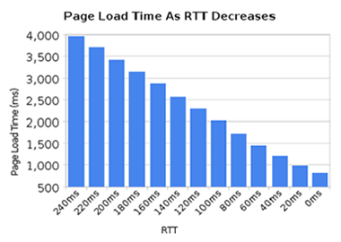
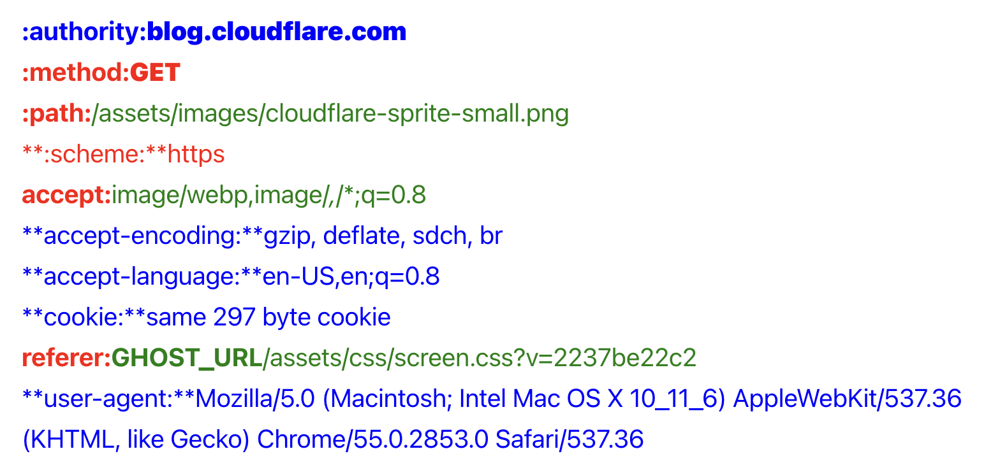
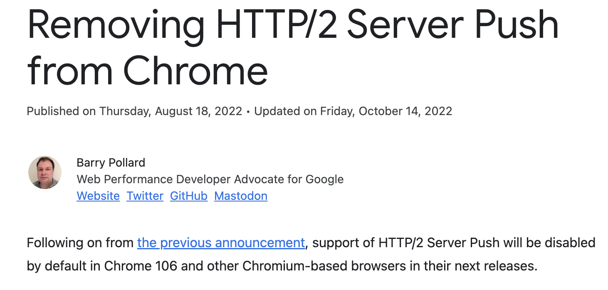
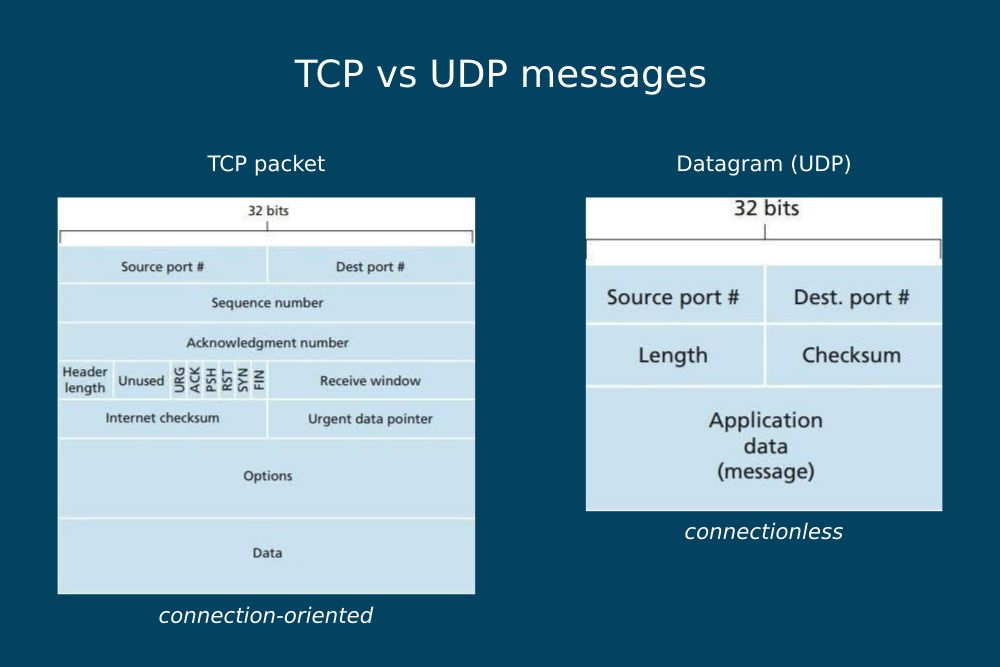
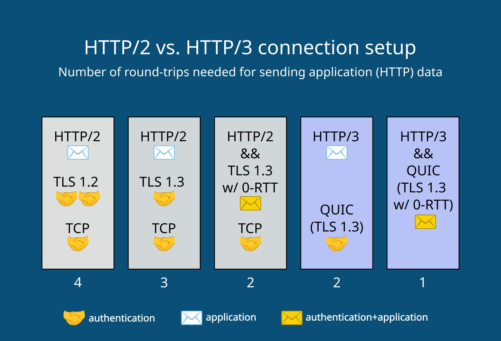
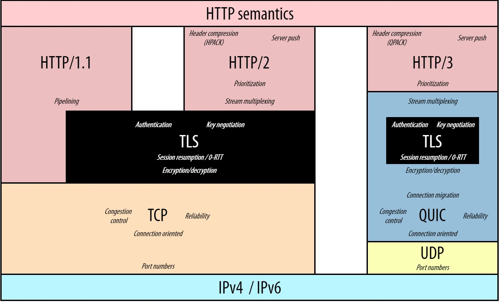

# HTTP/2 & HTTP/3

A brief instroduction

Michael Yin @ GloryLeague 🏀

---

## Availability on browsers

### HTTP2

* Chrome 4 (or early?), 2010, SPDY (predecessor of HTTP2)
* Chrome 40, January 2015
* Firefox 36, Februrary 2015
* RFC 7540, May 2015
* Safari on iOS 9, Sept 2015

### QUCI / HTTP3

* Chrome 83, November 2020
* Firefox 88, April 2021
* RFC 9114, June 2022 (HTTP3), RFC 9000, May 2021 (QUIC)

---

## Availability on servers

* puma (no HTTP/2 or HTTP/3)
* Cloudflare / Fastly
* AWS Cloudfront / Google Cloud CDN 
* Nginx (experimental for HTTP/3)
* Apache httpd (no HTTP/3 support)
* Caddy / LiteSpeed

---

## Availability on Programming Languages

Third-party modules are often available for HTTP/2 and HTTP/3.

Non-third-party HTTP/2 support:

* Node.js 8 (2019)
* Go (2022), 0.x module

---

## HTTP2 features

* TLS extension for protocol negotiation
* Multiplexed streams
* Stream prioritisation
* Stream flow control
* Header compression (HPACK)
* Server push

---

## TLS and HTTP2

HTTP2 still uses TCP/80 for `http://` and TCP/443/TLS for `https://`.

HTTP1.x provides `Connection: Upgrade` and `Upgrade:` headers for protocol extensibility (e.g for WebSocket). But that's too much overhead.

HTTP2 implements TLS extension for protocal negotiation (ALPN: Application Layer Protocol Negotiation) on top of using HTTP1.1 `Upgrade` header to save RTT.

Browser implementations all require TLS for HTTP2, only some non-browser clients (e.g `curl`) might have implemented clear-text HTTP2.

---

## HTTP/2: Multiplixed Streams

Two trains / Two requests

 

Multiplexed trains / Two requests in HTTP2


---

## HTTP/2: Multiplexed Streams

Latency kills: Internet bandwidth has increased a lot, while latency not quite the same level. HTTP/1.1 has become now quite latency sensitive.
   

---

## HTTP/2: Multiplexed Streams


---

## HTTP/2: Stream Prioritisation

Client construct and communicate a "prioritisation tree" that expresses how it would prefer to receive responses.

* Each stream may be assigned an integer weight between 1 and 256.
* Each stream may be given an explicit dependency on another stream.


* browsers / servers can have different implementations (no implementation)

---

## HTTP/2: Flow Control

Browser can pause / throttle some streams on the fly.

For example, the client may have requested a large video stream with high priority, but the user has paused the video and the client now wants to pause or throttle its delivery from the server to avoid fetching and buffering unnecessary data. 
* Each stream has a window size for each direction
* window size can be updated by `WINDOW_UPDATE` frame.

---

## HTTP/2: Header Compression

Existing HTTP/1 header `Content-Encoding` already handles payload compression. But not headers.



* red: static dictionary (common headers)
* green: Huffman encoded
* blue: dynamic dictionary

--- 

## HTTP/2: Header Compression

* Early versions of HTTP/2 and SPDY used zlib, with a custom dictionary, to compress all HTTP headers. This delivered an 85% to 88% reduction in the size of the transferred header data
* HPACK was developed to mitigate *BREACH*/*CRIME* attack. (both SSL1.1 and SPDY are vunerable)
* HPACK in real world
  > ... on average we are seeing a 76% compression for ingress headers. 
  > -- [Cloudflare](https://blog.cloudflare.com/hpack-the-silent-killer-feature-of-http-2/)

---

## HTTP/2: Server Push

 

---

## HTTP/2: Server Push

Example to use it in Nginx:
```
    location = /demo.html {
        http2_push /style.css;
        http2_push /image1.jpg;
        http2_push /image2.jpg;
    }
```

---

## HTTP/2: Server Push

Alternatives to Server Push

* 103 Early Hints: https://developer.chrome.com/blog/early-hints/
* Preloading critical resources: https://web.dev/preload-critical-assets/

---

## HTTP/3 Features

* use UDP-based QUIC as transport protocol
  Notes: QUIC stays as a transport protocol.([RFC 9000](https://datatracker.ietf.org/doc/html/rfc9000)) Many HTTP/3 features are actually QUIC features.
* Encryption / Decryption / Authentication (TLS being part of QUIC)
* 0-RTT handshake (QUIC/UDP)
* Multiplexed Streams (QUIC)
* Connection migration (QUIC)
* Header compression (HTTP3/QPACK)
* Server push (HTTP3)

---

## QUIC: UDP instead of TCP

U- what?



---

## QUIC: UDP instead of TCP

Features of UDP (comparing to TCP)

* connectionless (no handshake or byebye)
* not enforcing order (TCP enforce bytes order)
* no guarantee of delivery (TCP retransmits any lost packets)
* doesn't have congestion control (TCP has "additive increase/multiplicative decrease", "slow start" and "congestion window")

---

## QUIC: Faster handshakes

 

---

## QUIC's Role



---

## QUIC: if not UDP

* modify TCP?
* SCTP: Stream Control Transmission Protocol (existing transport layer protocol, 132)
* new transport layer protocol

--- 

## QUIC: Multiplexed Stream

* one connection, multiple streams sent via frames
* stream: order enforced, garenteed bytes
* lost / slow packet only affect one stream

---

## QUIC: Connection Migration

Connection migration is a performance feature of QUIC that supports users who experience a network change, such as mobile users on the go. QUIC makes connection migration (more or less) seamless by making use of connection identifiers.

---

## QUIC / HTTP3

* Stream prioritisation: moved to HTTP Extensible Priorities [RFC 9218](https://www.rfc-editor.org/rfc/rfc9218.html)
* QPACK for header compression (adapted version of HPACK from HTTP/2)
* Server Push (similar to HTTP/2 Server Push)

---

## HTTP/3 Limitation

* QUIC is always encrypted (no `http://` for HTTP3)
* HTTP version negotiation is required before using HTTP/3
  ```
  Alt-Svc: h3=":443"; ma=2592000,h3-29=":443"; ma=2592000
  ```
  [DNS Service Bindings (SVCB) is still on its way](https://blog.cloudflare.com/speeding-up-https-and-http-3-negotiation-with-dns/)
* QUIC consumes more CPU and memory than TCP (at the moment)
* 3 - 5% of networks block UDP, except for essential UDP traffic such as DNS requests. -- [source](https://www.rfc-editor.org/rfc/rfc9308#name-the-necessity-of-fallback)

---

## References

* HTTP2/HTTP3 availabilities on browsers: https://caniuse.com
* HTTP/2 Explained, Daniel Stenberg, author of curl: https://http2-explained.haxx.se/
* Introduction to HTTP/2, Chrome Developers: https://web.dev/performance-http2/
* HPACK: the silent killer (feature) of HTTP/2, Cloudflare: https://blog.cloudflare.com/hpack-the-silent-killer-feature-of-http-2/
* HTTP/3 Explained, Daniel Stenberg: https://http3-explained.haxx.se/
* HTTP/3: the past, the present, and the future, Cloudflare https://blog.cloudflare.com/http3-the-past-present-and-future/
* A Comprehensive Guide To HTTP/3 And QUIC, DebugBear: https://www.debugbear.com/blog/http3-quic-protocol-guide